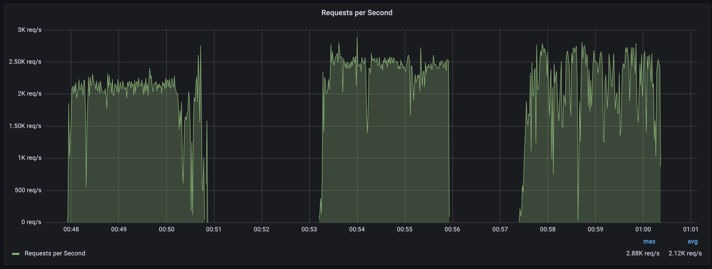

# Ingress Controller benchmark

## Prerequiste
```Docker```
## setup
```
sudo sh setup.sh
```
---
## benchmark
benchmark 폴더에서 돌려야 합니다.  
### load test
```
sh shell/benchmark.sh 
```
### load test - with custom app

```
#                      APP  VU   Duration
sh shell/benchmark.sh nginx 3000 3m
```
---
## Uninstall
```
sh uninstall.sh
```
## Result
```
# Benchmark with nginx server, 3000 VUs, 3m duration.
# All ingress controller has 1 pod. No HPA.
# Pod memory is 2Gi. CPU is 200m, 500m, each.

# Command:
sh shell/benchmark.sh nginx 3000 3m
```
### CPU 200m

high resolution


### CPU 500m

high resolution



Istio has high cpu usage.  
Nginx has a long tail latency with 400m+ cpu.
